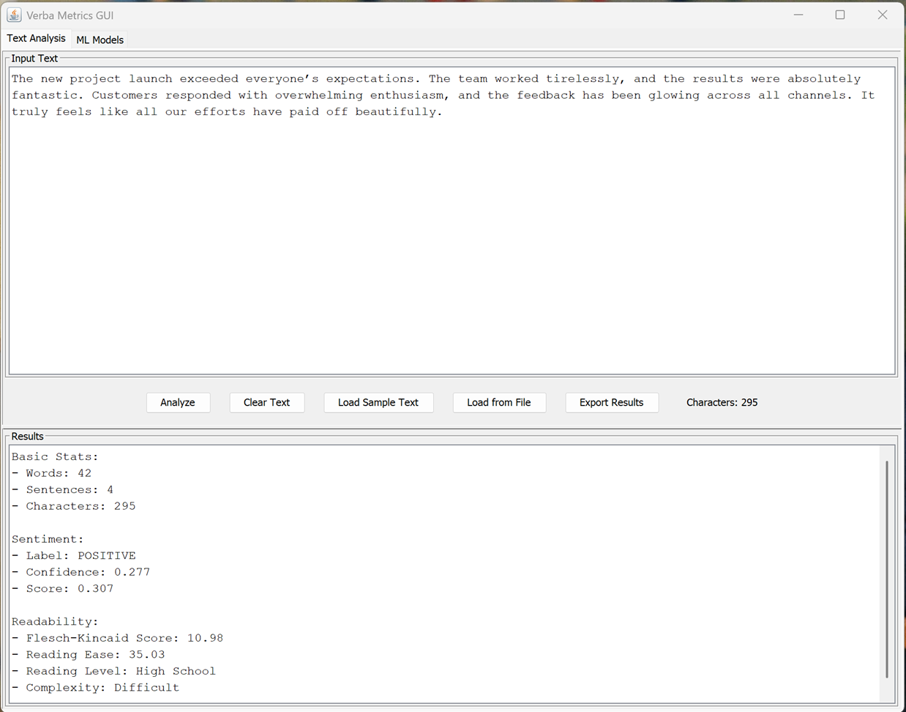
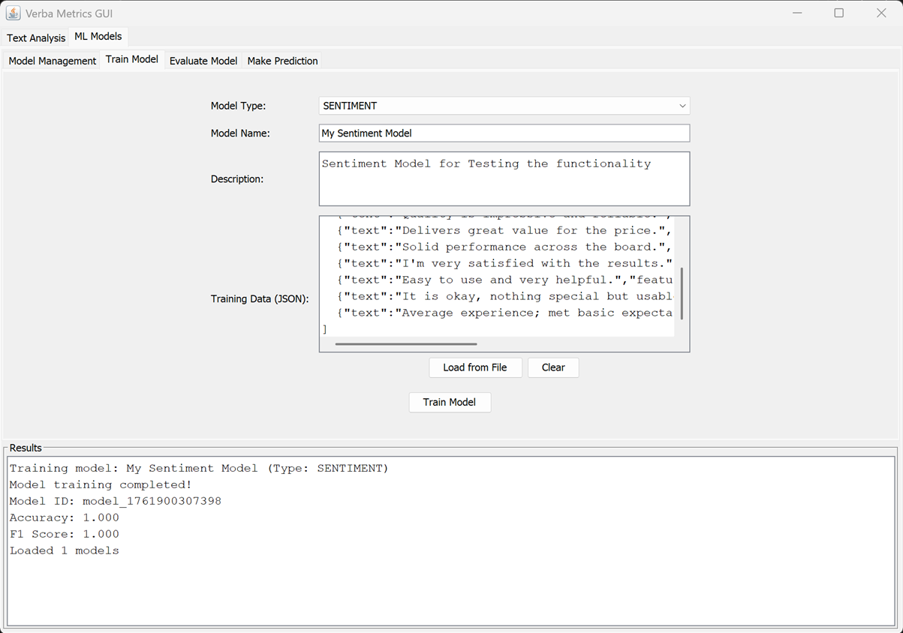

# Verba Metrics GUI - Screenshots and Examples

This document showcases the key features and workflows of Verba Metrics GUI through visual demonstrations and example results.

**Test Environment:** Verba Metrics GUI v1.0.0 | Java 21 | Windows 10

---

## 1. Text, Sentiment and Readability Analysis

For illustration, the following input text was analysed:

> The new project launch exceeded everyone's expectations. The team worked tirelessly, and the results were absolutely fantastic. Customers responded with overwhelming enthusiasm, and the feedback has been glowing across all channels. It truly feels like all our efforts have paid off beautifully.

**Results:**
- **Basic Stats:**
  - Words: 42
  - Sentences: 4
  - Characters: 295
- **Sentiment:**
  - Label: POSITIVE
  - Confidence: 0.277
  - Score: 0.307
- **Readability:**
  - Flesch-Kincaid Score: 10.98
  - Reading Ease: 35.03
  - Reading Level: High School
  - Complexity: Difficult



---

### Text Analysis in Action

To further demonstrate the capabilities of the Verba Metrics GUI, the following statements were also analysed, with their respective results summarized below.

> The product update was a total disappointment. The new version introduced more bugs than it fixed, and performance has drastically worsened. Users are complaining across forums, and customer support seems overwhelmed. It's hard to believe this release even passed basic testing.

**Results:**
- **Basic Stats:**
  - Words: 41
  - Sentences: 4
  - Characters: 278
- **Sentiment:**
  - Label: NEGATIVE
  - Confidence: 0.684
  - Score: -0.943
- **Readability:**
  - Flesch-Kincaid Score: 10.28
  - Reading Ease: 39.61
  - Reading Level: High School
  - Complexity: Difficult


These examples illustrate the effectiveness of the Verba Metrics GUI's text analysis capabilities across diverse datasets. Additional datasets and detailed analysis results are available in the project's GitHub repo for further exploration and validation.

---

## 2. Machine Learning Model Training and Management

Having demonstrated the platform's robust performance in sentiment and readability analysis, this section highlights the machine learning model functionality of Verba Metrics GUI. This includes end-to-end workflows for model training, evaluation, and prediction, showcasing the application's ability to support advanced text classification tasks.

### Model Training

To demonstrate the machine learning capabilities of the Verba Metrics GUI, we trained a sentiment classification model using the following dataset (JSON array):

```json
[
  {"text":"Performance was poor and inconsistent.","features":[0.11,0.83,0.06],"label":"negative"},
  {"text":"Bugs everywhere; I regret buying.","features":[0.07,0.88,0.05],"label":"negative"},
  {"text":"Unreliable and slow response times.","features":[0.09,0.85,0.06],"label":"negative"},
  {"text":"Fails frequently during normal use.","features":[0.06,0.90,0.04],"label":"negative"},
  {"text":"Delivers great value for the price.","features":[0.81,0.06,0.13],"label":"positive"},
  {"text":"Solid performance across the board.","features":[0.78,0.08,0.14],"label":"positive"},
  {"text":"I'm very satisfied with the results.","features":[0.80,0.07,0.13],"label":"positive"},
  {"text":"Easy to use and very helpful.","features":[0.83,0.06,0.11],"label":"positive"},
  {"text":"It is okay, nothing special but usable.","features":[0.43,0.28,0.29],"label":"neutral"},
  {"text":"Average experience; met basic expectations.","features":[0.41,0.29,0.30],"label":"neutral"}
]
```

**Note:** The Verba Metrics GUI supports both standard JSON arrays and JSONL (JSON Lines) format for training data input, providing flexibility for various data sources.


After clicking the **Train Model** button, a summary of the training process and results is displayed in the results box for immediate review.



---

### Model Management

Once the model has been successfully trained, you can proceed to the Model Management page, where all your trained models are conveniently listed for review and management. The interface provides dedicated tabs, allowing you to evaluate a model's performance or make predictions, each accessible independently for streamlined workflow.


To view detailed information about a specific model, simply select the desired model and click the **View Details** button; this will display the details for further analysis.


The details section provides a comprehensive overview of the selected model, enabling in-depth analysis and comparison. Once you are satisfied with the trained model after reviewing and validating its details, you can proceed to evaluate the model's performance.

---

### Model Evaluation

The following dataset was used for evaluating the trained model:

```json
[
  {"text":"Crashes during simple tasks; very unreliable.","features":[0.10,0.86,0.04],"label":"negative"},
  {"text":"Frequent errors and slow response.","features":[0.12,0.83,0.05],"label":"negative"},
  {"text":"Support is unhelpful and issues persist.","features":[0.13,0.82,0.05],"label":"negative"},
  {"text":"Works as expected but not impressive.","features":[0.44,0.28,0.28],"label":"neutral"},
  {"text":"Average quality; meets basic needs.","features":[0.42,0.30,0.28],"label":"neutral"},
  {"text":"Usable product with room for improvement.","features":[0.45,0.27,0.28],"label":"neutral"},
  {"text":"Excellent value and smooth performance.","features":[0.84,0.07,0.09],"label":"positive"},
  {"text":"Delighted with the overall experience.","features":[0.83,0.07,0.10],"label":"positive"},
  {"text":"Fast, reliable, and easy to recommend.","features":[0.85,0.06,0.09],"label":"positive"}
]
```


The evaluation results provide valuable insights into the model's accuracy and overall performance, including metrics such as accuracy, precision, recall, F1-score, and confusion matrix.

---

### Model Prediction

Next, you can use the trained model to make predictions on new text samples by navigating to the **Prediction** tab and entering your input.

The following dataset was used for making a prediction using the trained model:

```json
[
  {"text":"Keeps freezing; extremely frustrating.","features":[0.09,0.86,0.05]},
  {"text":"Pretty average overall.","features":[0.45,0.27,0.28]},
  {"text":"Exceeded expectations in every way.","features":[0.86,0.06,0.08]}
]
```


The prediction results show the predicted labels, probabilities, and confidence scores for each input, enabling you to assess the model's performance on unseen data.

---

## Summary

This comprehensive workflow demonstrates how Verba Metrics GUI streamlines the process from data input to model evaluation and prediction, supporting both novice and advanced users in text analysis and machine learning tasks.

For more information, installation instructions, and additional examples, please refer to the [README.md](README.md) and project documentation.
